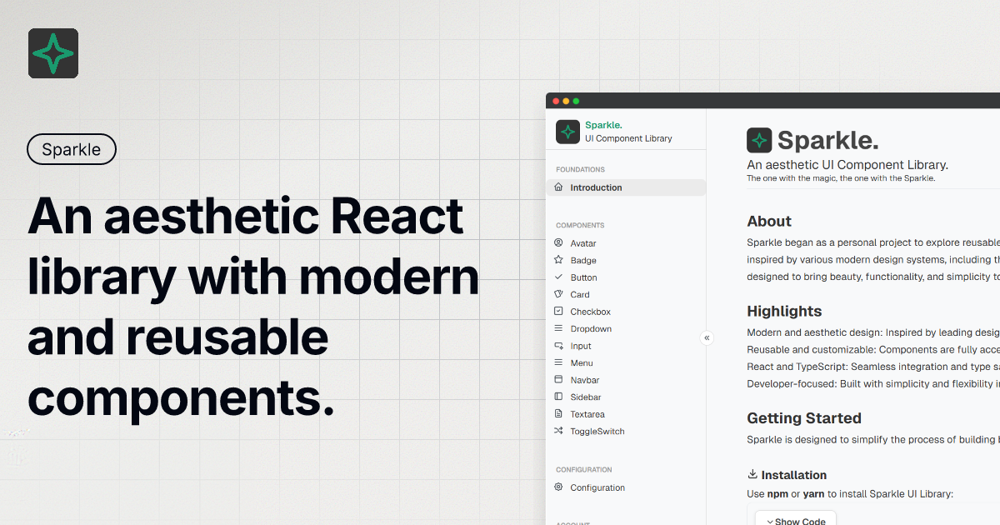

# ✨ Sparkle UI Library

<a href="https://sparkle-ui-library.netlify.app/" target="_blank">
  
</a>

**Sparkle** is an aesthetic React UI Component Library built with TypeScript and Vite. Designed to bring beauty, functionality, and simplicity to your user interfaces, it offers a modern take on reusable components inspired by leading design systems.

---

## 🚀 Live Demo

[Check out the live demo here!](https://sparkle-ui-library.netlify.app/)

Explore all components and their usage examples in the [live demo](https://sparkle-ui-library.netlify.app/).

---

## 📦 Installation

Install via npm:

```bash
npm install sparkle-ui-library
```

Or using Yarn:

```bash
yarn add sparkle-ui-library
```

---

## 🛠 Quick Usage Example

Here's how to use the `Avatar` and `Button` components:

```tsx
import { Avatar, Button } from "sparkle-ui-library";

export default function Example() {
  return (
    <div>
      <Avatar size="large">
        <Avatar.Image src="./avatar.jpg" alt="User Avatar" />
      </Avatar>
      <Avatar size="medium">
        <Avatar.Text>JD</Avatar.Text>
      </Avatar>
      <Button variant="primary">Click Me</Button>
    </div>
  );
}
```

For more examples and detailed component usage, visit the [live demo](https://sparkle-ui-library.netlify.app/).

---

## ✨ About Sparkle

Sparkle began as a personal project to explore reusable components and modern UI patterns. Named after one of my favorite songs, it’s inspired by various design systems, including the [Geist Design System](https://vercel.com/design/geist) from the Vercel team.

Sparkle is independently developed, aiming to provide developers with beautiful, functional, and easy-to-use components.

---

## 🌟 Highlights

- **Modern and Aesthetic Design**: Inspired by leading design systems.
- **Reusable and Customizable**: Components are fully accessible and easy to tweak.
- **React and TypeScript**: Seamless integration and type safety for developers.
- **Developer-Focused**: Built with simplicity and flexibility in mind.

---

## 📚 Available Components

- **Avatar**: Display user images or initials.
- **Button**: Customizable buttons with various styles and sizes.
- **Card**: Flexible content containers with headers and footers.
- **Dropdown**: Accessible dropdown menus.
- **Sidebar**: Layout components for side navigation.
- **Badge, Input, Navbar, ToggleSwitch**, and more!

For a full list of components and detailed examples, check out the [live demo](https://sparkle-ui-library.netlify.app/).

---

## 🎨 Customization

Most components accept props for easy customization:

```tsx
<Button variant="primary" size="large">
  Click Me
</Button>
```

- `variant`: `primary`, `secondary`, `danger`
- `size`: `small`, `medium`, `large`

For full prop documentation, visit the [live demo](https://sparkle-ui-library.netlify.app/).

---

## 🛠 Getting Started

Sparkle is designed to simplify the process of building beautiful and accessible user interfaces.

```bash
# Install Sparkle
npm install sparkle-ui-library

# Import and use a component
import { Button } from 'sparkle-ui-library';

export default function App() {
  return <Button variant="primary">Click Me</Button>;
}
```

---

## 🤝 Contributing

Contributions are welcome! 🎉  
If you’d like to contribute, please fork the repository and submit a pull request. For major changes, open an issue first to discuss what you'd like to improve.

---

## 📄 License

This project is licensed under the [MIT License](LICENSE).
